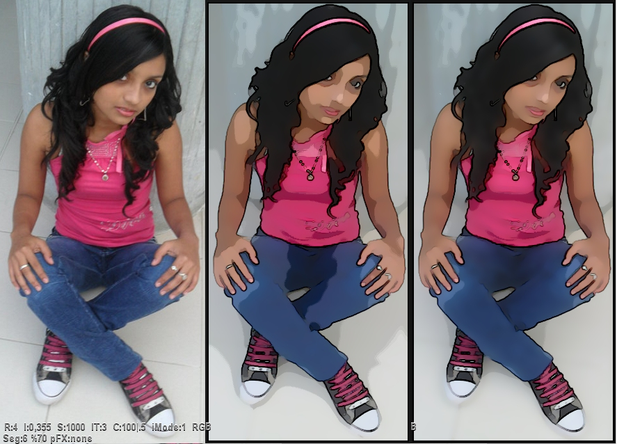



## Bilateral Filter \- Cartoonizer \(08Gen2011\)

### Description

This application applies Multipass Bilateral Filter to color Images.

Bilateral filtering is an Edge-preserving smoothing filter. This technique extends the concept of Gaussian

smoothing by weighting the filter coefficients with their corresponding relative pixel intensities. Pixels

that are very different in intensity from the central pixel are weighted less even though they may be in

close proximity to the central pixel. This is effectively a convolution with a non-linear Gaussian filter,

with weights based on pixel intensities. This is applied as two Gaussian filters at a localized pixel

neighborhood , one in the spatial domain, and one in the intensity domain.

Cartoon:

To obtain cartoon-like results, these new effects have been implemented:

* Contour

* Luminance Segmentation **' Licence: GPL3 ***
 
### More Info
 

             |
---                |---
**Submitted On**   |2011-02-10 13:16:40
**By**             |[reexre](https://github.com/Planet-Source-Code/PSCIndex/blob/master/ByAuthor/reexre.md)
**Level**          |Intermediate
**User Rating**    |5.0 (55 globes from 11 users)
**Compatibility**  |VB 6\.0
**Category**       |[Graphics](https://github.com/Planet-Source-Code/PSCIndex/blob/master/ByCategory/graphics__1-46.md)
**World**          |[Visual Basic](https://github.com/Planet-Source-Code/PSCIndex/blob/master/ByWorld/visual-basic.md)
**Archive File**   |[Bilateral\_2197792102011\.zip](https://github.com/Planet-Source-Code/reexre-bilateral-filter-cartoonizer-08gen2011__1-73648/archive/master.zip)

